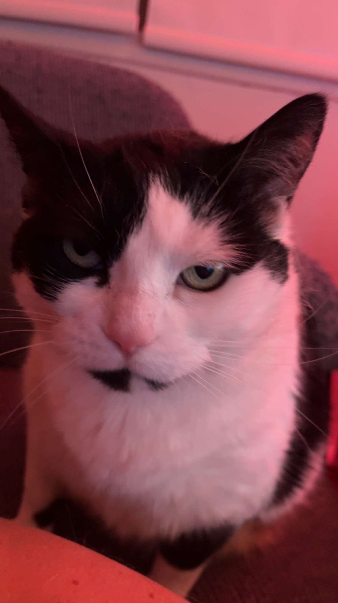

Selon nos informations, Mike aurait pris l'habitude de prendre son bain avec ses chats. « C'est pour les laver », affirme-t-il. Une version que les principaux intéressés contestent vivement.

## « Au début, je pensais que c'était une erreur »

Biscuit, témoin principal dans cette affaire, a accepté de nous rencontrer. Visiblement encore ébranlé, il a fixé notre journaliste sans cligner des yeux pendant de longues minutes avant de se confier.

« Au début, je pensais que c'était une erreur. Puis il a sorti le canard en caoutchouc. Et la bière. »

*Biscuit, lors de son entrevue exclusive. Il a demandé que son visage ne soit pas flouté : « Je veux que le monde sache. »*

Biscuit affirme aussi que Mike utilise son propre shampoing sur les chats. « Je sens le melon et la vanille depuis trois semaines. Les autres chats du quartier ne me respectent plus. »

## Les chats réclament des changements

Dans une lettre signée d'une patte, les félins demandent :

- un maximum d'un bain par année, « et seulement si on s'est roulés dans quelque chose de grave »;
- que la porte de la salle de bain reste ouverte en tout temps;
- que Mike arrête de chanter pendant le bain.

Notre équipe a tenté de joindre Mike. Il a répondu à travers la porte de la salle de bain : « Je peux pas parler, je suis occupé. » On entendait miauler en arrière-plan.
